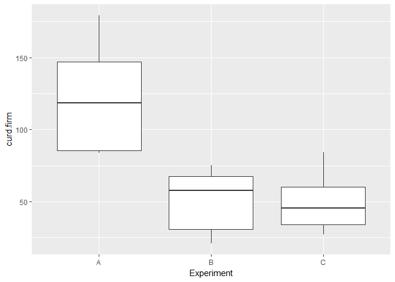
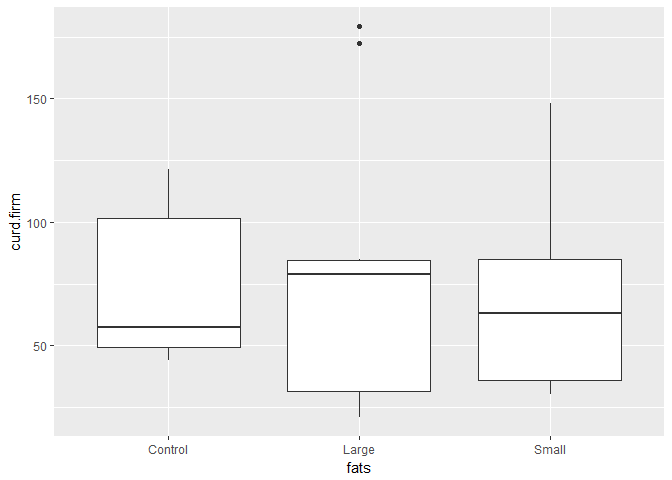
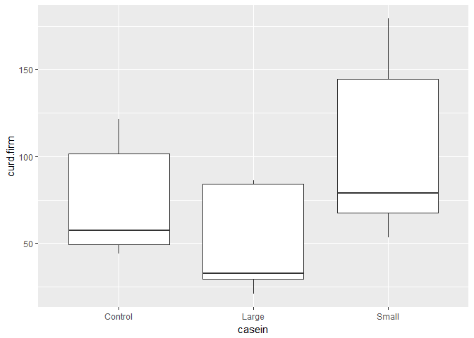
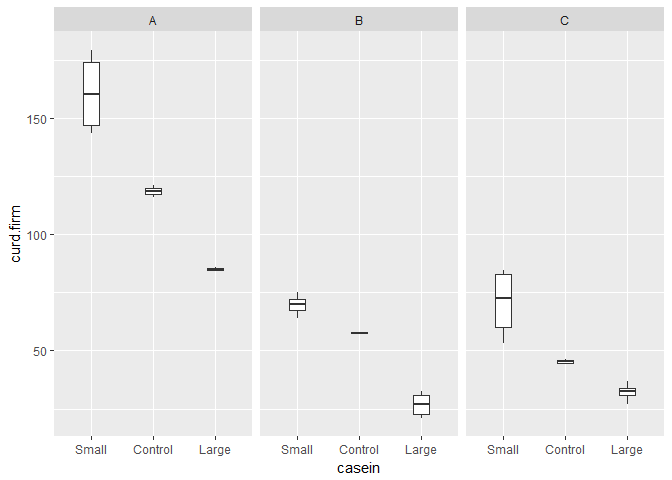
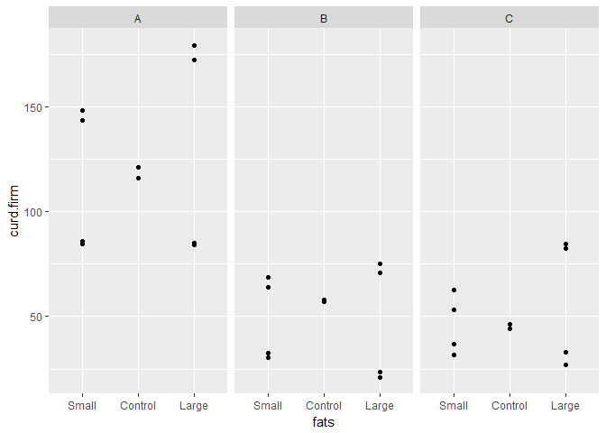
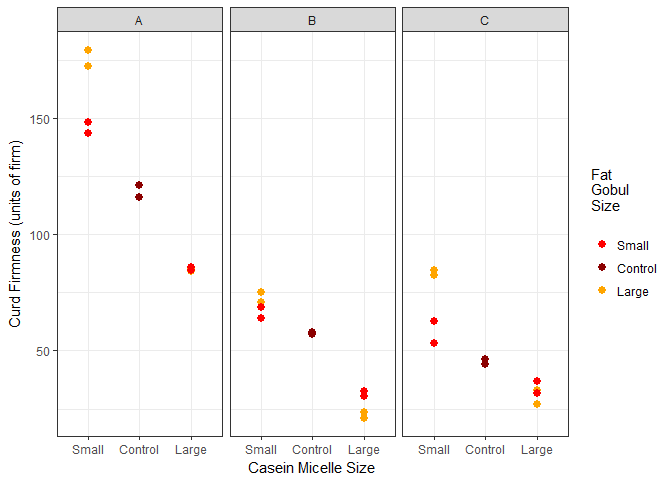

## Notes on data:
Renneting behaviour is an important milk property for milk-derived products like cheese. 
This experiment investigates the rennet gel 'curd firmness' after 1 hour for milks with different properties according to this design:
milk fat globule size (large/small) x casein micelle (large/small) + control = 5 milks in total. 

### 1. Call in data (having already resaved the file as ".csv" within excel)


```r
df <- read_csv("data/VisMilk.csv")
```


### write a summary of data, along with a list of the variables

```
## # A tibble: 3 x 12
##    Time Control Control_1 `LMFG-SCM` `LMFG-SCM_1` `SMFG-SCM` `SMFG-SCM_1`
##   <dbl>   <dbl>     <dbl>      <dbl>        <dbl>      <dbl>        <dbl>
## 1  3600    44.1      46.4       82.4         84.4       53.2         62.6
## 2  3600   116       121        172          179        148          143  
## 3  3600    58.0      57.1       75.2         70.8       68.8         63.9
## # ... with 5 more variables: `LMFG-LCM` <dbl>, `LMFG-LCM_1` <dbl>,
## #   `SMFG-LCM` <dbl>, `SMFG-LCM_1` <dbl>, Experiment <chr>
```

```
##  [1] "Time"       "Control"    "Control_1"  "LMFG-SCM"   "LMFG-SCM_1"
##  [6] "SMFG-SCM"   "SMFG-SCM_1" "LMFG-LCM"   "LMFG-LCM_1" "SMFG-LCM"  
## [11] "SMFG-LCM_1" "Experiment"
```

###Rename the columns to keep spaces consistent ("-" and "_" to ".")

```r
names(df)<-c("Time" , "Control","Control.1","LMFG.SCM","LMFG.SCM.1" ,"SMFG.SCM","SMFG.SCM.1",
           "LMFG.LCM","LMFG.LCM.1", "SMFG.LCM","SMFG.LCM.1", "Experiment")
df$Time #check time points
```

```
## [1] 3600 3600 3600
```

### 2. Make the data tidy
 a. "Time" is constant throughout the data, so remove this variable 
all together (doing this first to avoid confusion later on)
 b. the dependent variable (trait being tested) is milk curdness, so "gather" the columns from wide to long, and generate a new column called "curd.firm"
 c. separate out the milk type columns into three, generating a fat globules ("fats"), 
casein micelle ("casein") and "replicate" columns (rep0 & rep1)
 d. and then remove redundancies to make the data tidy (type)

```r
df.tidy<-df%>%
  select(-Time) %>% 
  gather(key=Type, value=curd.firm, -Experiment)%>% 
  mutate(Type, fats = ifelse(grepl('LMFG', Type)==TRUE, "Large", 
                             ifelse(grepl('SMFG', Type)==TRUE, "Small","Control")))%>%
  mutate(Type, casein = ifelse(grepl('.LCM', Type)==TRUE, "Large",
                             ifelse(grepl('.SCM', Type)==TRUE, "Small","Control")))%>%
  mutate(Type, replicate = ifelse(grepl('.1', Type)==TRUE,"rep1", "rep0"))%>% 
  select(-Type) 
```


### 3. Run some trial plots to explore the data, starting general, and then focusing in on the details.
a. boxplot - Does experiment afft curd firmness?

```r
ggplot(df.tidy, aes(x = Experiment, y=curd.firm)) +
  geom_boxplot() 
```

<!-- -->

#Looks like experiment A leads to firmer curd than experiments B and C

b. boxplot - How does the fat globule size affect firmness?

```r
ggplot(df.tidy, aes(x = fats, y=curd.firm)) +
  geom_boxplot() 
```

<!-- -->
some variation in mean, but high variance, so not conclusions here

c. boxplot - And caesin?

```r
ggplot(df.tidy, aes(x = casein, y=curd.firm)) +
  geom_boxplot() 
```

<!-- -->

same as above, need to group be Experiment

d. Including experiment here...
Trying to reorder the factors here into small control (assuming this is "medium") and large
couldn't work out the tidyverse version of reordering factors 

```r
df.tidy$casein <- factor(df.tidy$casein,
                         levels = c("Small", "Control", "Large"),ordered = TRUE)
ggplot(df.tidy, aes(x = casein, y=curd.firm)) +
  geom_boxplot()  +  #Need this to make a boxplot
  facet_wrap(~Experiment)
```

<!-- -->
Looks like the smaller the casein micelles the firmer the curd
and repeat the above, but this time with fat globules


```r
df.tidy$fats <- factor(df.tidy$fats,
                         levels = c("Small", "Control", "Large"),ordered = TRUE)

ggplot(df.tidy, aes(x = fats, y=curd.firm)) +
  geom_point()  + 
  facet_wrap(~Experiment)
```

<!-- -->
here, looks like there's no strong relationship with fats and curd-firm two outliers here specific to a particualar experiment..?


## FINAL FIGURE

### 4. Generate a final plot, focusing on casein over fats


```r
df.tidy$casein <- factor(df.tidy$casein,
                       levels = c("Small", "Control", "Large"),ordered = TRUE)

ggplot(df.tidy, aes(x = casein, y=curd.firm, color=fats)) +
  geom_point(size=2.5)  + 
  facet_grid(~Experiment) +
  scale_color_manual(values = c("red", "dark red", "orange")) +
  labs(x="Casein Micelle Size", y="Curd Firmness (units of firm)" , color="Fat\nGobul\nSize") +
  theme_bw()
```

<!-- -->

```r
ggsave(filename="Assign1.VisMilk.scatter.casein.jpg", 
       width=7, height=4)
```
